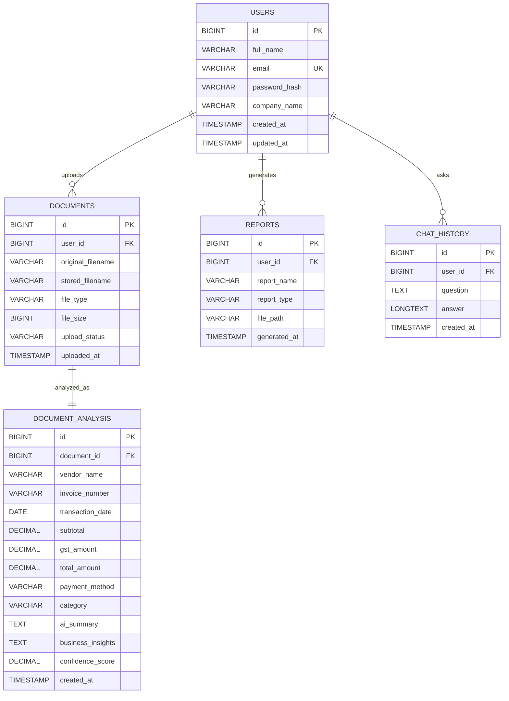

```mermaid
erDiagram

    USERS ||--o{ DOCUMENTS : uploads
    USERS ||--o{ REPORTS : generates
    USERS ||--o{ CHAT_HISTORY : asks
    DOCUMENTS ||--|| DOCUMENT_ANALYSIS : analyzed_as

    USERS {
        BIGINT id PK
        VARCHAR full_name
        VARCHAR email UK
        VARCHAR password_hash
        VARCHAR company_name
        TIMESTAMP created_at
        TIMESTAMP updated_at
    }

    DOCUMENTS {
        BIGINT id PK
        BIGINT user_id FK
        VARCHAR original_filename
        VARCHAR stored_filename
        VARCHAR file_type
        BIGINT file_size
        VARCHAR upload_status
        TIMESTAMP uploaded_at
    }

    DOCUMENT_ANALYSIS {
        BIGINT id PK
        BIGINT document_id FK
        VARCHAR vendor_name
        VARCHAR invoice_number
        DATE transaction_date
        DECIMAL subtotal
        DECIMAL gst_amount
        DECIMAL total_amount
        VARCHAR payment_method
        VARCHAR category
        TEXT ai_summary
        TEXT business_insights
        DECIMAL confidence_score
        TIMESTAMP created_at
    }

    REPORTS {
        BIGINT id PK
        BIGINT user_id FK
        VARCHAR report_name
        VARCHAR report_type
        VARCHAR file_path
        TIMESTAMP generated_at
    }

    CHAT_HISTORY {
        BIGINT id PK
        BIGINT user_id FK
        TEXT question
        LONGTEXT answer
        TIMESTAMP created_at
    }
```